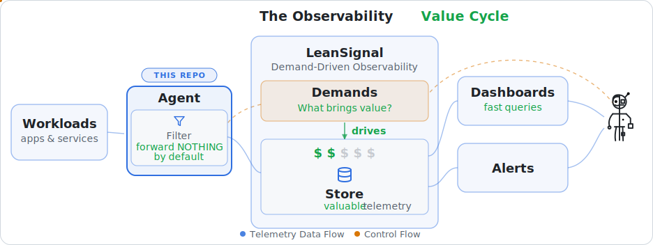

# LeanSignal Agent

[](LICENSE)
[](https://github.com/LeanSignal/leansignal-agent/actions/workflows/ci.yml)
[](https://github.com/LeanSignal/leansignal-agent/releases)

The **LeanSignal Agent** is a custom [OpenTelemetry Collector](https://opentelemetry.io/docs/collector/)
distribution that collects **telemetry** — metrics, logs, and traces — writes
**everything** to co-located stores for full local fidelity, and forwards only
the **demanded** subset to a central, long-retention dataplane. Each signal has
its own local store:
[VictoriaMetrics](https://victoriametrics.com/) for metrics,
[Loki](https://grafana.com/oss/loki/) for logs, and
[Tempo](https://grafana.com/oss/tempo/) for traces.

The agent lives in **your** network and dials **out** to LeanSignal — it needs no
inbound access. A single long-lived gRPC stream carries the metric index up,
the demand set down, and edit-mode queries both ways, so the LeanSignal UI can
read your full-fidelity local stores without them ever being exposed.

It runs on Kubernetes, Linux, macOS, and Windows, and is released under the
**Apache 2.0** license.

## How it works

The agent is the edge half of LeanSignal's demand-driven **Value Cycle**. It
sees everything your workloads emit and keeps it at full fidelity locally, but
its filters forward **nothing by default** — only the telemetry a declared
**demand** asks for ever leaves your network. Central cost follows value, not
volume, and the agent is the component that enforces it:

<picture>
  <source media="(prefers-color-scheme: dark)" srcset="docs/assets/value-cycle-dark.svg">
  
</picture>

- **Everything** is written to the local store for each signal next to the agent —
  metrics to VictoriaMetrics, logs to Loki, traces to Tempo.
- The **edge controller** keeps one persistent, outbound gRPC stream to LeanSignal:
  it reports the discovered metric/timeseries **index**, receives the **demand
  set** (metric names, log stream selectors, and trace resource selectors), and
  answers **edit-mode queries** the UI runs against the local stores (read-only,
  allow-listed — the stores are never exposed to the internet).
- A **demand filter per signal** drops everything not demanded before it reaches
  the central dataplane — so the central stores only hold what's asked for. In
  production the agent remote-writes demanded metrics through **vmauth**, and
  pushes demanded log streams and trace spans to the tenant Loki/Tempo through the
  ingest ingress, all authenticated by its agent key.

See [docs/architecture.md](docs/architecture.md) for the full design.

## Agent modes: central & edge

An agent installs in one of two modes:

- **central** (default) — the full agent above: co-located stores (VictoriaMetrics,
  Loki, Tempo), the metrics tracker, per-signal demand filters, dataplane
  forwarding, and the gRPC control channel.
- **edge** — a lightweight OTLP **forwarder**. It collects host metrics, OTLP from
  local apps, and its own self-telemetry, stamps identity labels, and ships
  everything as OTLP to a **central** agent. No local stores, tracker, demand
  filters, or control channel. Selected by giving the central agent's OTLP endpoint
  at install (`--central-url HOST:PORT` or `CENTRAL_AGENT_GRPC_URL`).

```
   Host A (edge)  ─┐
   Host B (edge)  ─┼─ OTLP ─▶  Host C (central) ─▶ local stores + demanded → dataplane
   Host C (central)┘
```

This fans many edge agents across networks into one central aggregation point.
Every metric carries `leansignal_agent_name`, `host_name`, `os_type`, and
`leansignal_mode` (`edge`/`central`) labels, so each source stays distinct in the
shared store. The central agent's OTLP receiver is open and unauthenticated by
design — keep it on a trusted/internal network. See
[docs/configuration.md](docs/configuration.md).

## Quick start

> **Managing an install** — how to check service **status**, **start/stop/restart**
> the agent and its co-located stores (VictoriaMetrics, Loki, Tempo), view the
> agent's **own logs**, and **uninstall** is covered in the per-OS guide for your
> platform:
> [Linux](docs/install-linux.md) · [macOS](docs/install-macos.md) ·
> [Windows](docs/install-windows.md) · [Kubernetes](docs/install-kubernetes.md).

### Kubernetes (Helm)

You only need your **agent key** and your **tenant** — the gRPC control host
(`<tenant>-grpc.<domain>`) and the ingest host (`<tenant>-ingest.<domain>`) are
derived (domain defaults to `eu11.leansignal.io`; override with
`--set leansignal.domain=…`).

```bash
helm upgrade --install leansignal-agent \
  oci://ghcr.io/leansignal/charts/leansignal-agent \
  --namespace leansignal --create-namespace \
  --set leansignal.tenant="YOUR_TENANT" \
  --set leansignal.agentKey.value="YOUR_KEY" \
  --set victoria-metrics-single.enabled=true
```

`leansignal.agentName` sets the `leansignal_agent_name` label (defaults to the node name).
See [docs/install-kubernetes.md](docs/install-kubernetes.md).

### Linux / macOS

```bash
curl -fsSL https://raw.githubusercontent.com/LeanSignal/leansignal-agent/main/scripts/install/install.sh \
  | sudo bash -s -- --agent-key YOUR_KEY --agent-name this-host --tenant YOUR_TENANT
```

Installs the agent + its co-located stores (VictoriaMetrics for metrics, Loki for
logs, Tempo for traces) and registers them as services (systemd / launchd).
`--agent-name` labels this host's telemetry. See
[docs/install-linux.md](docs/install-linux.md) and
[docs/install-macos.md](docs/install-macos.md).

### Windows (PowerShell, as Administrator)

```powershell
.\install.ps1 -AgentKey YOUR_KEY -AgentName this-host -Tenant YOUR_TENANT
```

See [docs/install-windows.md](docs/install-windows.md).

### Docker (trial)

The fastest way to try the agent against a tenant — runs the agent and its
co-located stores (VictoriaMetrics, Loki, Tempo) as containers:

```bash
export LEANSIGNAL_ENDPOINT=... LEANSIGNAL_AGENT_KEY=... LEANSIGNAL_DATAPLANE_ENDPOINT=...
docker compose -f deploy/docker/docker-compose.yaml up
```

## Upgrading

The agent and its co-located stores run as **separate services**, and each
store's data lives in a fixed directory outside the binaries — so **upgrading the
agent never stops those stores or touches their data**. That's the default.
Upgrading VictoriaMetrics is a separate, snapshot-first, opt-in step. Both paths
roll back automatically if the service doesn't come back healthy. Full guide:
[docs/upgrading.md](docs/upgrading.md).

### Kubernetes (Helm)

```bash
helm upgrade leansignal-agent oci://ghcr.io/leansignal/charts/leansignal-agent \
  --version <chart-version> --reuse-values
```

Bumps the agent image; the co-located store StatefulSets + PVCs are retained.

### Linux / macOS

```bash
# agent only — VictoriaMetrics + its data are untouched (the common case)
curl -fsSL https://raw.githubusercontent.com/LeanSignal/leansignal-agent/main/scripts/install/upgrade.sh | sudo bash

# pin a version, or also upgrade VictoriaMetrics (snapshots first)
curl -fsSL https://raw.githubusercontent.com/LeanSignal/leansignal-agent/main/scripts/install/upgrade.sh | sudo bash -s -- --version v0.2.0
curl -fsSL https://raw.githubusercontent.com/LeanSignal/leansignal-agent/main/scripts/install/upgrade.sh | sudo bash -s -- --with-vm
```

### Windows (PowerShell, as Administrator)

```powershell
.\upgrade.ps1                 # agent only — VictoriaMetrics + its data untouched
.\upgrade.ps1 -Version v0.2.0
.\upgrade.ps1 -WithVM         # also upgrade VictoriaMetrics (snapshots first)
```

## Documentation

Full docs live in [docs/](docs/index.md):

- [Usage](docs/usage.md) — send telemetry, query the local stores, how demand works
- [Configuration](docs/configuration.md) — settings, env vars, pipelines
- [Upgrading](docs/upgrading.md) — agent-only vs store upgrades, data safety, rollback
- [Agent own telemetry](docs/own-telemetry.md) — the self-monitoring metrics the agent exposes and what to alert on
- [Architecture](docs/architecture.md) · [Components](docs/components.md)
- [Development guide](docs/development.md) · [Releasing](docs/releasing.md)

The agent is configured with a standard OpenTelemetry Collector config file; see
[config/agent-config.example.yaml](config/agent-config.example.yaml).

## Building & running from source

```bash
make install-tools   # OCB, addlicense, goreleaser (one-time)
make test            # go test -race ./components/...
make local-build     # OCB-generate (if needed) + compile -> _build/leansignal-agent
```

Then run the prebuilt binary — no recompile — against a **local** or a **cloud**
LeanSignal:

```bash
make local-run                                  # vs local lean-api (:9090, h2c) + local VM (:8482)
make cloud-run TENANT=mb1 AGENT_KEY=…           # vs a cloud tenant over TLS (…-grpc.<domain>:443)
```

`make build` / `make snapshot` produce the release artifacts (all platforms). The
distribution is assembled by the [OpenTelemetry Collector Builder](https://github.com/open-telemetry/opentelemetry-collector/tree/main/cmd/builder)
from [`manifest.yaml`](manifest.yaml); first-party code lives under
[`components/`](components/). See the [development guide](docs/development.md) for
the full local/cloud run loop.

## Contributing & support

- [Contributing guide](CONTRIBUTING.md) (DCO sign-off required)
- [Code of Conduct](CODE_OF_CONDUCT.md)
- [Security policy](SECURITY.md)

## License

Apache 2.0 — see [LICENSE](LICENSE) and [NOTICE](NOTICE). Bundles OpenTelemetry
Collector, and pairs with VictoriaMetrics, Loki, and Tempo as co-located stores
(all Apache 2.0).
