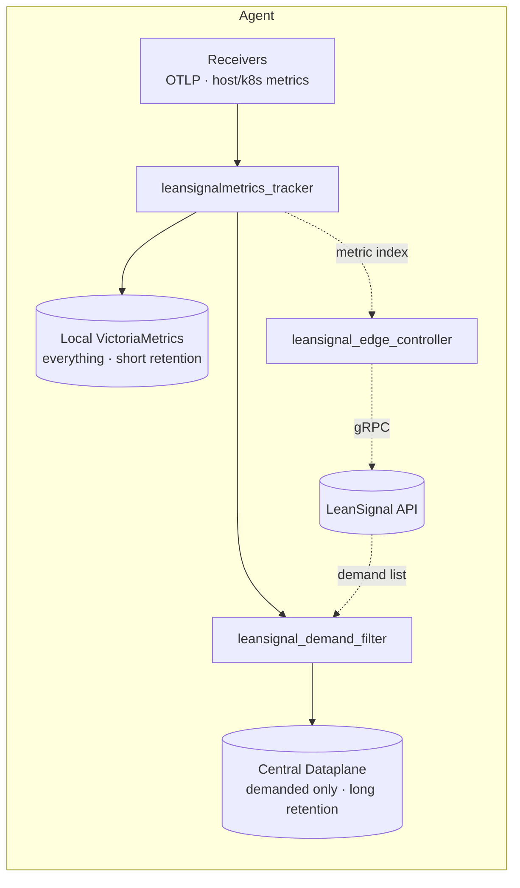

# LeanSignal Agent

[](LICENSE)
[](https://github.com/LeanSignal/leansignal-agent/actions/workflows/ci.yml)
[](https://github.com/LeanSignal/leansignal-agent/releases)

The **LeanSignal Agent** is a custom [OpenTelemetry Collector](https://opentelemetry.io/docs/collector/)
distribution that collects metrics, keeps a live **metric index** in sync with
the LeanSignal control plane, writes **everything** to a co-located
[VictoriaMetrics](https://victoriametrics.com/) for full local fidelity, and
forwards only the **demanded** subset to a central, long-retention dataplane.

It runs on Kubernetes, Linux, macOS, and Windows, and is released under the
**Apache 2.0** license.

## How it works



- **Everything** is written to the local VictoriaMetrics next to the agent.
- The **edge controller** keeps a persistent gRPC stream to LeanSignal: it reports
  the discovered metric/timeseries index and receives the **demand list**.
- The **demand filter** drops everything not on the demand list before metrics
  reach the central dataplane — so the central store only holds what's asked for.

See [docs/architecture.md](docs/architecture.md) for the full design.

## Quick start

### Kubernetes (Helm)

```bash
helm upgrade --install leansignal-agent \
  oci://ghcr.io/leansignal/charts/leansignal-agent \
  --namespace leansignal --create-namespace \
  --set leansignal.endpoint="api.leansignal.com:443" \
  --set leansignal.agentKey.value="YOUR_KEY" \
  --set dataplane.endpoint="https://dataplane.example.com/api/v1/write" \
  --set victoria-metrics-single.enabled=true
```

See [docs/install-kubernetes.md](docs/install-kubernetes.md).

### Linux / macOS

```bash
curl -fsSL https://raw.githubusercontent.com/LeanSignal/leansignal-agent/main/scripts/install/install.sh \
  | sudo bash -s -- \
    --agent-key YOUR_KEY \
    --endpoint api.leansignal.com:443 \
    --dataplane-endpoint https://dataplane.example.com/api/v1/write
```

Installs the agent + local VictoriaMetrics and registers them as services
(systemd / launchd). See [docs/install-linux.md](docs/install-linux.md) and
[docs/install-macos.md](docs/install-macos.md).

### Windows (PowerShell, as Administrator)

```powershell
.\install.ps1 -AgentKey YOUR_KEY `
  -Endpoint api.leansignal.com:443 `
  -DataplaneEndpoint https://dataplane.example.com/api/v1/write
```

See [docs/install-windows.md](docs/install-windows.md).

### Docker (trial)

```bash
export LEANSIGNAL_ENDPOINT=... LEANSIGNAL_AGENT_KEY=... LEANSIGNAL_DATAPLANE_ENDPOINT=...
docker compose -f deploy/docker/docker-compose.yaml up
```

## Documentation

Full docs live in [docs/](docs/index.md):

- [Usage](docs/usage.md) — send metrics, query the local store, how demand works
- [Configuration](docs/configuration.md) — settings, env vars, pipelines
- [Architecture](docs/architecture.md) · [Components](docs/components.md)
- [Development guide](docs/development.md) · [Releasing](docs/releasing.md)

The agent is configured with a standard OpenTelemetry Collector config file; see
[config/agent-config.example.yaml](config/agent-config.example.yaml).

## Building from source

```bash
make install-tools   # OCB, addlicense, goreleaser
make test            # go test -race ./components/...
make build           # OCB-generate + compile the full distribution
make snapshot        # local goreleaser build for all platforms
```

The distribution is assembled by the [OpenTelemetry Collector Builder](https://github.com/open-telemetry/opentelemetry-collector/tree/main/cmd/builder)
from [`manifest.yaml`](manifest.yaml); first-party code lives under
[`components/`](components/).

## Contributing & support

- [Contributing guide](CONTRIBUTING.md) (DCO sign-off required)
- [Code of Conduct](CODE_OF_CONDUCT.md)
- [Security policy](SECURITY.md)

## License

Apache 2.0 — see [LICENSE](LICENSE) and [NOTICE](NOTICE). Bundles OpenTelemetry
Collector and VictoriaMetrics (both Apache 2.0).
